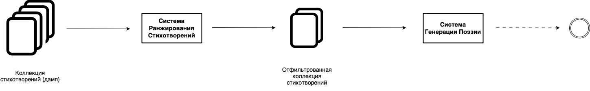
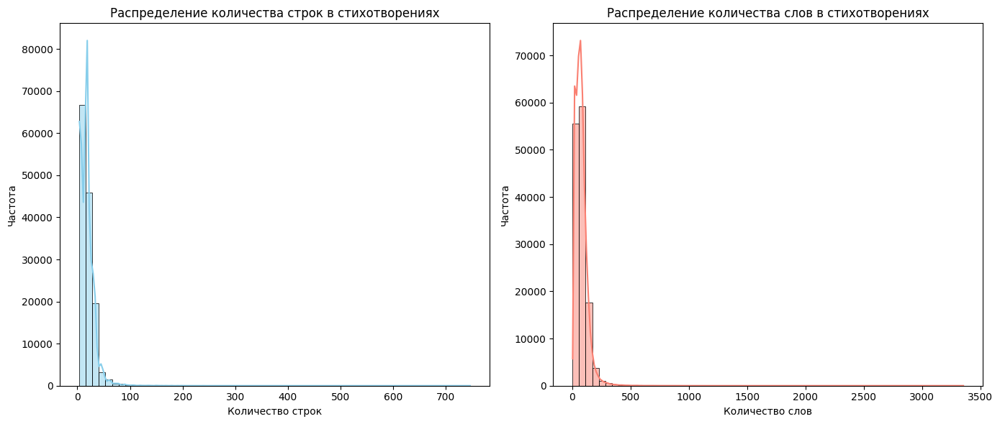
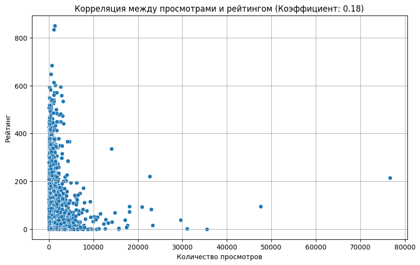
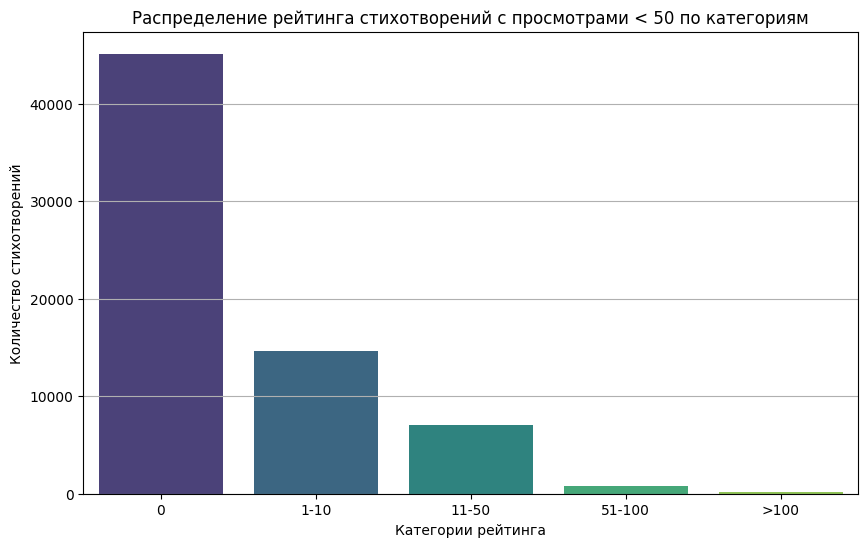
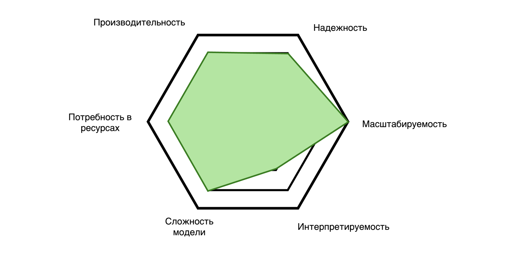
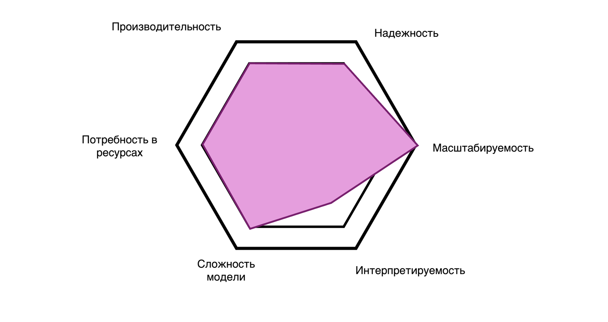
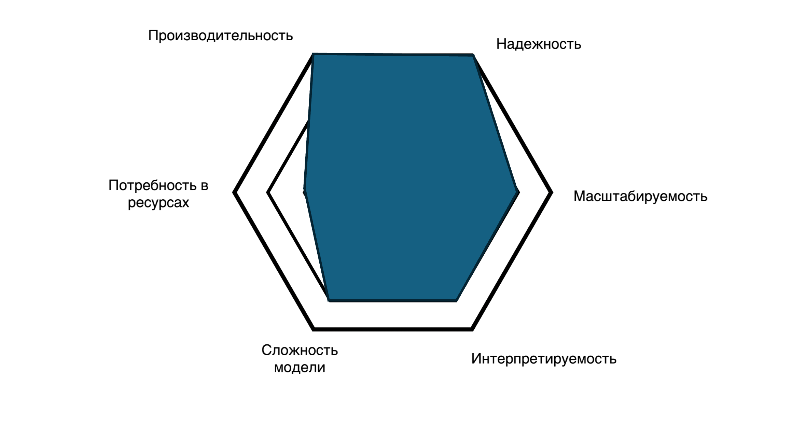
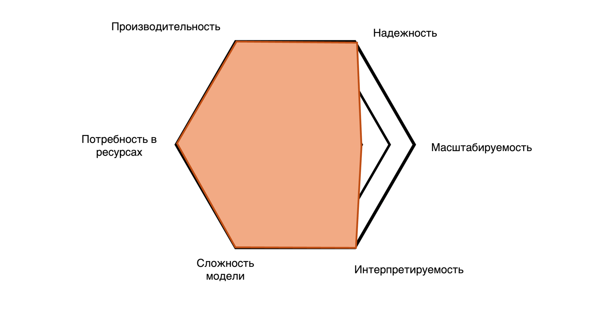

# Ранжировщик стихотворений

### 1. Понимание бизнеса и данных.

Система ранжирования стихотворений имеет большое количество применений, как непосредственно, помогая в различных жизненных сферах, так и являясь компонентом другой, более крупной системы.

#### 1.1 Идеи применения такого сервиса:

* **Обучение моделей глубинного и машинного обучения.**

   Разработчики могут использовать ранжированную поэзию для обучения моделей, которые будут лучше понимать и генерировать поэтический язык. В данном случае ранжировщик выступает частью другой системы, например, системы генерации стихов или обработки естественного языка. Использование высокоранжированных стихотворений позволяет улучшить качество обучения модели, делая её более способной к созданию оригинальных и качественных поэтических произведений.

* **Оценка образовательных работ.**

   Преподаватели могут использовать такую систему, чтобы оценивать поэтические работы студентов, предоставляя стандартизированный метод оценки различных критериев стихотворений, таких как креативность, техника и глубина темы. Здесь модель ранжирования будет выступать как инструмент для объективного анализа работ учеников, облегчая процесс оценки и предоставляя конструктивную обратную связь.

* **Сохранение культурного наследия.**

   Такие институты, как библиотеки и музеи, могут использовать систему ранжирования для того, чтобы отбирать самые значимые поэтические работы, концентрируя усилия на их сохранении со временем. Это способствует сохранению культурного наследия и обеспечивает доступ будущих поколений к наиболее ценным произведениям поэтического искусства.

* **Рекомендации стихотворений.**

   Платформы со стихотворениями могут использовать модель ранжирования для улучшения персонализации рекомендаций, увеличивая удовлетворенность пользователей. Благодаря этому читатели смогут получать предложения наиболее подходящих им по стилю и содержанию стихотворений, что повысит их интерес и вовлеченность.

* **Развлечения и СМИ.**

   Система ранжирования может использоваться как источник высоко оцененных стихотворений для их последующего использования в медиа-контенте. Например, для создания цепляющей рекламы с использованием переработанных, высокоранжированных и, следовательно, запоминающихся стихотворений. Это может повысить эффективность рекламных кампаний и привлечь больше внимания аудитории.

Как видно, существует множество применений для модели ранжирования поэзии. В данном случае мы будем рассматривать ситуацию, когда ранжировщик используется для отбора лучших стихотворений для дальнейшего использования в большей AI системе (идея №1).

Как можно придумать множество идей для использования данной системы, так и может существовать множество систем, где ранжировщик выступает как компонент. Мы предполагаем, что верхнеуровневый дизайн системы (рис. 1) выглядит следующим образом: в систему ранжирования подаётся коллекция стихотворений (предполагается, что это "сырая", обширная коллекция поэзии). Эта коллекция фильтруется, чтобы выделить меньшую коллекцию (размер может определяться пользователем), которая будет соответствовать определённым критериям, например, топ-100 лучших стихотворений по мнению ранжировщика. Затем эта коллекция передаётся в следующую систему, например, для обучения моделей внутри этой системы.

<center></center>
<center><strong>Рисунок 1</strong>. Верхнеуровневый дизайн системы ранжирования стихотворений. На изображении представлен общий поток данных в системе ранжирования стихотворений: от подачи исходной коллекции поэзии через ранжировщик и фильтрацию до передачи отобранных стихотворений в последующие модули или системы.</center>

### 1.2. Критерии успеха системы ИИ

Критерии успеха системы будут зависеть от бизнес-задачи, которую мы хотим решить, и экономического эффекта, которого мы стремимся достигнуть. Рассмотрим некоторые идеи оценки успеха системы, которые подходят для выбранного нами дизайна:

- **Улучшение качества обучающих данных для модели генерации поэзии**
- **Снижение риска ошибок при отборе контента**
- **Улучшение качества AI-генерированной поэзии**

Оценим каждую из этих идей по следующим критериям: критерий бизнес-успеха, критерий успеха в ML/DL и экономический критерий успеха.

---

#### **Улучшение качества обучающих данных для модели генерации поэзии**

- **Критерий бизнес-успеха:**

  Система должна отбирать топ-**X%** лучших стихотворений из общей коллекции для обучения модели генерации поэзии, повышая качество генерируемых произведений и, следовательно, удовлетворённость пользователей.

- **Критерий успеха в ML/DL:**

  Модель ранжирования должна достигать точности не менее **Y%** в идентификации высококачественных стихотворений по сравнению с оценками экспертов (в нашем случае — это рейтинг на платформе стихотворений).

- **Экономический критерий:**

  Снижение затрат на подготовку данных на **Z%** благодаря автоматизации процесса отбора стихотворений, что ведёт к экономии ресурсов.

---

#### **Снижение риска ошибок при отборе контента**

- **Критерий бизнес-успеха:**

  Снизить вероятность пропуска важных или неподходящих стихотворений на **X%**, обеспечивая соответствие контента требованиям компании или законодательства.

- **Критерий успеха в ML/DL:**

  Модель должна достигать **Y%** точности в фильтрации нежелательного контента (например, стихов на политическую тему) и обнаружении важных произведений, соответствующих заданным критериям.

- **Экономический критерий:**

  Снижение потенциальных затрат на юридические риски или репутационные потери на **Z%**, обеспечивая соблюдение стандартов и повышая доверие пользователей.

---

#### **Улучшение качества AI-генерированной поэзии**

- **Критерий бизнес-успеха:**

  Повысить качество поэзии, генерируемой AI-моделями, до уровня, сопоставимого с работами профессиональных поэтов, увеличивая удовлетворённость конечных пользователей на **X%**.

- **Критерий успеха в ML/DL:**

  Модель генерации поэзии, обученная на отобранных данных, должна получать оценки качества (например, рейтинг на сайте) не ниже **Y** при тестировании с участием пользователей.

- **Экономический критерий:**

  Увеличение конкурентоспособности продукта на рынке на **Z%**, что ведёт к росту продаж и доли рынка благодаря уникальным возможностям AI-модели.

---

Выберем бизнес-цель нашей системы. Мы строим непосредственно ранжировщик стихотворений, поэтому качество генерации поэзии нас интересует не напрямую. Соответственно, на текущем этапе можно исключить **Улучшение качества AI-генерированной поэзии** из списка.

**Снижение риска ошибок при отборе контента** звучит привлекательно, так как может уберечь от непредвиденных убытков. Однако система генерации поэзии может уже иметь QA-процессы, которые предотвращают нежелательные случаи генерации неприемлемой поэзии. Поэтому в качестве бизнес-цели системы выберем **«Улучшение качества обучающих данных для модели генерации поэзии»**.


### 1.3. Осуществимость проекта
Проверим возможность создания системы ранжирования с доступными для нас вводными. Будем смотреть на следующие критерии, которые можно разделить на две группы - бизнес критерии и критерии, предъявляемые к данным:

Бизнес и технические критерии:
* Целесобразность использования ML/DL подходов для решение пободной задачи.
* Внешние ограничения на применение систему (легальные, социальные и т. п.).
* Технические требования к системе.


Критерии, предъявляемые к данным:
* Доступность данных.
* Размер данных.
* Качество данных.


**Бизнес-критерии**

**Целесообразность использования подходов ML/DL для решения подобной задачи**

Чтобы определить, насколько целесообразно применение методов искусственного интеллекта в данной задаче, необходимо найти либо систему со схожим функционалом, либо построить быстрый MVP для создания proof of concept (PoC) нашей системы.

Рассмотрим существующие аналогичные проекты:

* [PoetryAssessor](https://www.poetryassessor.com/hello)

Этот проект оценивает стихотворения на предмет их схожести с произведениями известных (публикующихся) поэтов. Положительная метка (значения метки ранжируются от -5 до 5) указывает на близость поэзии к известным произведениям, отрицательная — на обратное. В нашем случае оценка, близкая к 5, может свидетельствовать о более высоком качестве стихов.

* [Erato](https://arxiv.org/abs/2310.20326)

В этой статье авторы создают систему автоматической оценки поэзии, как настоящей, так и сгенерированной. Сравнение достигается анализом различных аспектов произведений, таких как стили рифмования, количество строф и т. п. Исследование показывает, что с помощью такой автоматической системы можно достаточно точно отличать сгенерированную поэзию от человеческой. Это демонстрирует возможность создания автоматической системы для оценки и ранжирования стихотворений.

* [Poem Classification Using Machine Learning Approach](https://link.springer.com/chapter/10.1007/978-81-322-1602-5_72)

Данная работа показывает, что с использованием методов машинного обучения можно классифицировать поэзию. В исследовании применяются такие классические алгоритмы, как KNN, Naive Bayes и SVM, которые достигают высокого качества в задаче классификации. Это указывает на то, что у стихотворений есть определённые признаки, которые помогают лучше понять поэзию и, следовательно, на основе этих признаков можно оценить качество работы. Также это подтверждает гипотезу, что алгоритмы глубокого обучения смогут выявить зависимости в поэзии, поскольку они действительно существуют.

Наличие аналогичных проектов и исследований показывает, что применение методов машинного и глубокого обучения является обоснованным решением и заслуживает внимания.

**Внешние ограничения на применение системы (легальные, социальные и т. д.).**

- **Использование произведений, защищённых авторскими правами.**  
  В идеале следует ограничить выборку данных произведениями, не защищёнными авторским правом. Однако такие произведения могут ухудшить качество обучающей выборки, поэтому важно найти баланс между качеством материалов и их правовым статусом.

- **Использование веб-скрейпинга.**  
  Создание высокой нагрузки на источники данных (платформы стихотворений, форумы и т. п.) может негативно сказаться на их работоспособности. Хотя веб-скрейпинг в России легален, необходимо подходить к этому вопросу с осторожностью, чтобы избежать потенциальных проблем.

- **Использование нелегального или спорного контента.**  
В выборку могут попасть нежелательные материалы, такие как политический, дискриминационный и прочий спорный контент. Необходимо тщательно отбирать данные для обучения системы, чтобы избежать подобных проблем.

Существует ряд ограничений, которые необходимо учитывать при построении системы, но нет таких, которые бы препятствовали началу реализации проекта.

**Технические требования к системе.**

Можно выделить следующие основные требования к системе:

- **Надёжность.**

  Система ранжирования должна обеспечивать стабильные результаты для различных данных и быть устойчивой к отказам других систем. Стабильность может достигаться контролем качества обучающей выборки, выбором оптимальной модели и обеспечением качества данных (QA). Поскольку система ранжирования является компонентом другой системы, которая не критично зависит от неё (процесс обучения не является конечным продуктом), она достаточно устойчива к сбоям в других компонентах.

- **Масштабируемость.**

  Обучающие данные предполагают большой объём, который необходимо обрабатывать. Масштабируемость является одним из ключевых требований к системе. Необходимо тщательно продумать архитектуру системы: выбрать инструменты обработки, модель и способ развёртывания сервиса.

- **Объяснимость.**

  Объяснимость модели может быть полезна для понимания способов её улучшения, но не является обязательным критерием для данной системы.

- **Ресурсы.**

  Объём необходимых ресурсов будет зависеть от выбранных архитектурных решений. Потенциальные затраты включают:

  * При высокой нагрузке системы может потребоваться использование распределённых систем, таких как обработка данных на кластере или репликация приложения с моделью.
  * Обучение модели может требовать значительных вычислительных ресурсов, например, графических процессоров (GPU).
  * Затраты на хранение больших объёмов данных.
  * Расходы на формирование команды специалистов.


Исходя из настоящих критериев успеха, можно сделать вывод об осуществимости требований к системе. Дальнейшие решения должны основываться на этих критериях.


### 1.4. Сбор данных.

Наша цель — ранжировать предоставленный датасет стихотворений, поэтому нам подходят любые тексты поэзии на русском языке. Мы можем ограничивать и разнообразить выборку по жанрам, тематикам или длине произведений в зависимости от требований системы; например, если нужно оценивать романтическую поэзию, то логично сосредоточиться на таких стихах. У нас уже имеется собранный датасет с сайта «Изба-Читальня» (https://www.chitalnya.ru), который мы будем использовать для обучения модели.


### 1.5. EDA + DQ.

**Описание данных.**

| Признак       | Описание                                  | Тип данных |
|---------------|------------------------------------------|------------|
| url           | Ссылка на страницу с текстом стихотворения | String     |
| rating        | Рейтинг, присвоенный стихотворению        | Integer    |
| views         | Количество просмотров страницы со стихотворением | Integer |
| output_text   | Текст стихотворения                       | String     |
| genre         | Жанр стихотворения                        | String     |

**Количество данных.**  
Всего в датасете 172995 стихотворений. Из них в трейн выборке — 138396 стихотворений, а в тестовой выборке — 34599 стихотворений.

**Распределение жанров**  
Топ-10 жанров в датасете:

| Жанр                   | Процент |
|------------------------|---------|
| Лирика                 | 52.97%  |
| Юмор                   | 21.19%  |
| Песни                  | 7.50%   |
| Эротика                | 2.57%   |
| Поэтические переводы   | 2.23%   |
| Акростихи              | 1.74%   |
| Стихи для детей        | 1.64%   |
| Басни                  | 1.44%   |
| Поэмы и циклы стихов   | 1.33%   |
| Частушки               | 1.18%   |

Как видно из распределения, некоторые жанры представлены значительно меньше, чем доминирующие жанры, такие как Лирика, Юмор и Песни.

**Распределение слов в стихотворениях.**  
- Среднее количество строк: 19.06
- Медиана количества строк: 17.00
- Среднее количество слов: 78.68
- Медиана количества слов: 70.00

<center></center>
<center><strong>Рисунок 2</strong>. Распределение слов и строк. График показывает, что распределение скошено: в данных больше коротких и средних стихов, чем длинных.</center>

**Зависимость рейтинга от количества просмотров.**  
- Коэффициент корреляции: 0.18

<center></center>
<center><strong>Рисунок 3</strong>. Связь просмотров и рейтинга. Очевидная связь между количеством просмотров и рейтингом не прослеживается.</center>

**Распределение рейтинга у непопулярных стихов.**  
Для стихотворений с низким количеством просмотров распределение выглядит следующим образом:

<center></center>
<center><strong>Рисунок 4</strong>. Распределение рейтинга у непопулярных стихов. Большинство стихов имеют нулевой рейтинг.</center>

**Количество пропусков в данных**

| Признак      | Количество |
|--------------|------------|
| url          | 0          |
| rating       | 0          |
| views        | 0          |
| output_text  | 0          |
| genre        | 0          |

Пропусков в данных нет.

### 2. Моделирование
### 2.1. Возможные варианты моделей

1. **Encoder + регрессия**
   - Данный подход использует предобученную языковую модель Encoder для извлечения эмбеддингов стихотворений, которые затем подаются на регрессионную модель. Регрессионная модель предсказывает количественную оценку (у нас в качестве метки выступает reviews) каждого стихотворения, которая служит основанием для ранжирования.

2. **Encoder + классификация**
   - В этом случае модель Encoder используется для извлечения эмбеддингов, которые затем передаются на классификационную модель, обученную на заранее определённых уровнях или категориях. Классификация позволяет присвоить стихотворению конкретный класс (в нашем случае 10).

3. **Encoder + классическое ранжирование (Pairwise/Triplet)**
   - Классические методы ранжирования, такие как pairwise или triplet ранжирование, подразумевают, что модель обучается на парах или тройках примеров, где задача заключается в предсказании лучшего (или худшего) стихотворения в каждом наборе. Pairwise ранжирование сравнивает две строки и определяет их относительное качество, тогда как triplet ранжирование использует тройки, где позиция в паре/тройке определяется рейтингом.

4. **LLM (Llama-3.2-3B-Instruct-Q8_0) + инструкция**
   - Использование большой LLM с инструкцией предполагает, что LLM выполняет ранжирование стихотворений по заданным инструкциям. Задача модели выдать общий "счет" для стихотворения по разным критериям, далее стихотворения ранжируются по этому значению.
  
### 2.2. Сравнение моделей
Проведем сравнение модели по следующим критериям (максимум 3 за каждый критерий):
| Параметр                 | Описание |
|--------------------------|----------|
| **Производительность**    | Производительность модели на данных, которые не использовались при обучении. |
| **Устойчивость**         | Устойчивость модели к некорректным входным данным и сбоям в среде выполнения. |
| **Масштабируемость**     | Способность модели масштабироваться на большие объёмы данных в производственной системе. |
| **Объяснимость**         | Способность модели предоставлять объяснение своих предсказаний (непосредственно или постфактум). |
| **Сложность модели**     | Соответствие сложности модели сложности данных. |
| **Потребность в ресурсах** | Потребность модели в ресурсах для развертывания. |


**Encoder + регрессия.**
<center></center>
<center><strong>Рисунок 4</strong>. Оценка Encoder с задачей регрессии.</center>
Использование предобученного Encoder должно позволить выделить основную идею произведения. Можно предположить, что такой подход позволить предсказать примерный рейтинг стихотворения из сжатой информации, что позволит достаточно легко ранжировать много текстов. Из-за использования скрытого предстовления, модель становится неинтерпретируемый.  

**Encoder + классификация.**
<center></center>
<center><strong>Рисунок 5</strong>. Оценка Encoder с задачей классификации.</center>
Такие же оценки, что в прошлом подходе, так как подходы достаточо идиентичны. Может работать лучше из-за разбиение таргета на малое количество бинов, что может позволить улучшить качество предсказаний.


**Классическое ранжирование (Pairwise/Triplet).**
<center></center>
<center><strong>Рисунок 6</strong>. Оценка классического подхода ранжирования.</center>
Обучение на парах/тройках увеличивает устойчивость к несоответствиям, работает с небольшими ресурсами, но сложен в масштабировании на большие объемы данных.


**LLM (Llama-3.2-3B-Instruct-Q8_0) + инструкция.**
<center></center>
<center><strong>Рисунок 7</strong>. Оценка LLM для ранжирования.</center>
Отлично подходит для гибкого ранжирования по заданным критериям, хорошо объясним, но требует много ресурсов и трудно масштабируется на большие объемы.


### 2.3. Оценка моделей
В этом проекте мы протестировали все представленные подходы, анализируя их эффективность и подходящую структуру для задачи ранжирования стихотворений. 

#### ruBERT + Регрессия
Для этого подхода использовался предобученный **ruBERT** в качестве энкодера. К модели был добавлен линейный слой, преобразующий скрытые состояния в оценку качества стихотворения. Основной меткой для обучения служил рейтинг (rating) стихотворения, который модель должна предсказывать с минимальной ошибкой. В качестве функции потерь использовалась **Mean Squared Error (MSE)**, что позволяет минимизировать среднеквадратичную ошибку, фокусируясь на точных числовых предсказаниях.

#### ruBERT + Классификация
В этом варианте также использовался **ruBERT** как энкодер, но задача была адаптирована под многоклассовую классификацию. Для этого рейтинги были преобразованы в **10 классов**, и модель обучалась предсказывать принадлежность стихотворения к одному из этих классов. Скрытые состояния ruBERT проходили через линейный слой для предсказания класса оценки. В качестве функции потерь использовалась **Cross-Entropy**, что эффективно для задач многоклассовой классификации, позволяя модели обучаться на точности распределения между классами.

#### Классическое ранжирование (Pairwise/Triplet)
Для классического ранжирования была реализована модель, обучающаяся на парах или тройках стихотворений. В этом подходе использовался **ruBERT** в комбинации с линейным слоем, где модель училась предсказывать вероятность того, что одно стихотворение лучше другого. Положение в каждой паре/тройке определялось рейтингом стихотворения, что помогает модели понимать относительные отличия между стихами. В качестве функции потерь применялся **Margin-based hinge loss**, который акцентирует внимание на правильном ранжировании и минимизации ошибок в определении положения стихотворений относительно друг друга.

#### LLM (Llama-3.2-3B-Instruct-Q8_0) + Инструкция
Последним этапом мы протестировали подход с использованием крупной языковой модели **Llama-3.2-3B-Instruct** для zero-shot оценки стихотворений. Модель получала инструкцию следующего содержания:

```
'''
   Вы – эксперт по поэзии. Оцените следующее стихотворение на русском языке по каждому из следующих критериев, присваивая баллы от 1 до 100, и затем суммируйте:

    1. Оригинальность и креативность
    2. Эмоциональное воздействие
    3. Мастерство владения языком и стилем
    4. Глубина и значимость темы

    Ваш ответ должен быть в формате:
    Общий балл = число

    Стихотворение:
'''
```

После оценки по этим критериям, итоговый балл использовался для ранжирования стихотворений. Этот подход позволяет модельной системе гибко адаптироваться к заданным критериям и применять экспертную оценку по широкому диапазону параметров, что усиливает интерпретируемость и объяснимость модели.

**Метрики**

Для оценки качества ранжирования можно использовать различные метрики, которые дают представление о релевантности и точности расстановки текстов в зависимости от их предсказанных оценок. Поскольку наша система ранжирования является компонентом более крупной системы, полезно выделить внутренние и внешние метрики.

**Внутренние метрики:**  
Эти метрики оценивают непосредственно качество работы системы ранжирования. Положение в ранжированном списке определяется предсказанным рейтингом для каждого стихотворения, что позволяет моделям ориентироваться на релевантность и точность расположения результатов. Основные метрики:

1. **NDCG (Normalized Discounted Cumulative Gain)** – Оценивает релевантность результатов с учетом их позиций в списке. Чем выше качество ранжирования на первых позициях, тем выше показатель NDCG, что особенно важно для пользовательского опыта.

2. **MAP (Mean Average Precision)** – Усредненная точность, вычисляющая среднюю прецизионность на каждом уровне релевантности. Подходит для задач, где важна релевантность лучших позиций, так как оценивает среднее качество по всему списку.

3. **MRR (Mean Reciprocal Rank)** – Средний обратный ранг, который показывает позицию первого релевантного стихотворения в списке. Полезен, когда важна точность первых позиций.

4. **Precision@k** – Доля релевантных стихотворений среди первых \( k \) позиций. Эффективен для оценки качества топовых результатов, особенно если ранжирование критично на первых местах.

5. **Recall@k** – Доля найденных релевантных стихотворений среди первых \( k \) позиций относительно общего количества релевантных стихотворений. Полезен для оценки полноты списка в первых позициях.

**Внешние метрики:**  
Поскольку ранжировщик является частью системы генерации стихотворений, его улучшение может способствовать общему качеству генерируемых текстов. Здесь могут быть полезны метрики, характерные для оценки качества текстов, особенно поэтических.

1. **BLEU (Bilingual Evaluation Understudy Score)** – Сравнивает совпадения фраз и слов между сгенерированным и эталонным текстами, что важно для оценки лексической точности.

2. **ROUGE (Recall-Oriented Understudy for Gisting Evaluation)** – Измеряет схожесть по совпадению фраз, слов или символов, что помогает оценить стилевое и содержательное сходство.

3. **METEOR (Metric for Evaluation of Translation with Explicit ORdering)** – Включает учет лемм, синонимов и порядка слов, что позволяет выявлять лексическую и семантическую близость с эталонными текстами, особенно полезную для поэзии.

4. **Perplexity** – Измеряет «уверенность» модели в создании связного текста. Чем ниже показатель перплексии, тем лучше связанность текста, хотя эта метрика не всегда отражает поэтические качества.

Мы используем **NDCG** в качестве основной внутренней метрики для оценки непосредственно ранжировщика, так как она дает ясное представление о релевантности и точности ранжирования.

**Результаты:**

| Модель                                           | Метрика |
|--------------------------------------------------|---------|
| **ruBERT + Регрессия**                           | 0.69    |
| **ruBERT + Классификация**                       | _       |
| **Классическое ранжирование (Pairwise/Triplet)** | Недостаточно ресурсов для формирования и обучения на парах/тройках |
| **LLM (Llama-3.2-3B-Instruct-Q8_0) + Инструкция** | Недостаточно ресурсов, модель выдаёт нерелевантные результаты | 

 